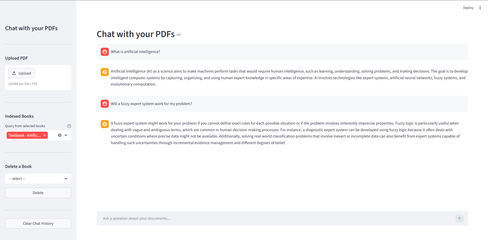

# Chat-with-Book

A Streamlit application for chatting with PDF documents using Ollama + Qdrant.



## Requirements

- Python 3.10+
- [Ollama](https://ollama.com) running locally
- [Qdrant](https://qdrant.tech) running locally (Docker recommended)

## Setup

### 1. Start Qdrant

```bash
docker run -p 6333:6333 qdrant/qdrant
```

### 2. Pull Ollama models

```bash
ollama pull llama3.2:1b
ollama pull qwen3-embedding:0.6b-fp16
```

### 3. Install dependencies

```bash
pip install -r requirements.txt
```

### 4. Configure environment

Edit `.env` to match your setup:

```env
QDRANT__SERVICE__API_KEY="your_qdrant_api_key"
QDRANT_URL="http://localhost:6333"
QDRANT_COLLECTION_NAME=pdf_rag
OLLAMA_MODEL="qwen2.5:7b"
EMBEDDING_MODEL="qwen3-embedding:0.6b-fp16"
CHUNK_SIZE=1000
CHUNK_OVERLAP=200
LOG_LEVEL=INFO
```

### 5. Run the app

```bash
streamlit run app.py
```

## Project Structure

```
chat-with-book/
├── models/
│   ├── rag_engine.py     # RAG logic (indexing, retrieval, answering)
├── utils/
│   ├── config.py         # Settings via pydantic-settings
│   ├── logger.py         # Logging setup
├── app.py            # Streamlit UI
├── .env              # Environment variables
└── requirements.txt
```

## Features

- Upload and index multiple PDF files
- Select which books to query
- Delete indexed books from the vector store
- Chat with memory (last 6 messages used as context)
- MultiQueryRetriever for better recall
- Qdrant as vector store

---
## 👨‍💻 Author
Developed by **Omar Adly**  
